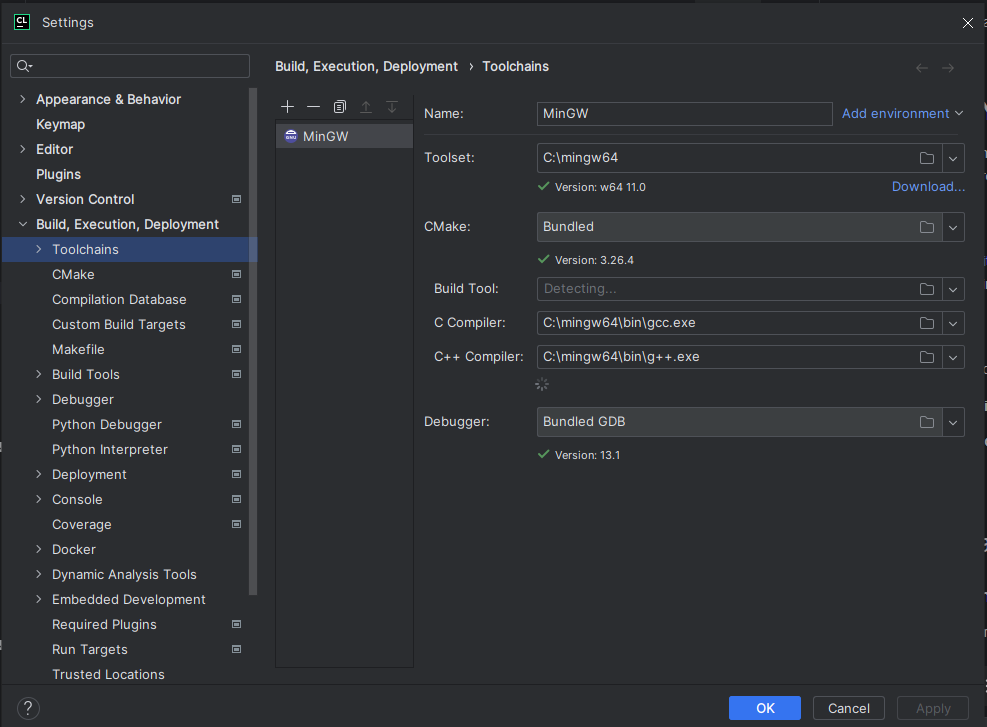
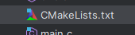
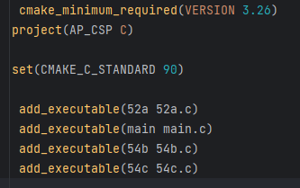
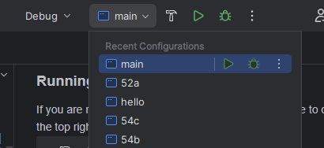
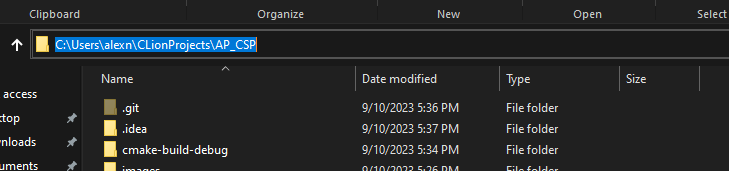
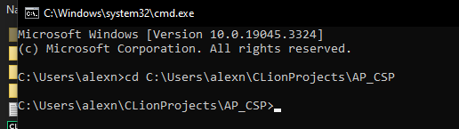
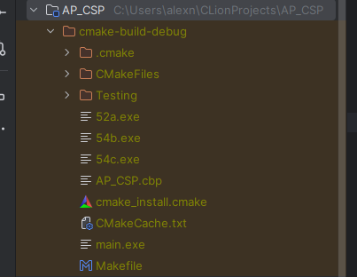

<h1>Handbook on Programming in C</h1>

**AP Computer Science Principles 2023-2024**

Alex Nouansacksy

<!-- This is a comment (which will not be displayed in the live file);
replace all "???" with your own text. -->


___


<h1>Table of Contents</h1>

- [1. Compiling and Running](#1-compiling-and-running)
- [2. Data Types](#2-data-types)
- [3. Console I/O](#3-console-io)
- [4. Arithmetic Operations](#4-arithmetic-operations)
- [5. Assignment Operations](#5-assignment-operations)
- [6. Comments](#6-comments)
- [7. Decision Structures](#7-decision-structures)
- [8. Conditional Operators](#8-conditional-operators)
- [9. Logic Operators](#9-logic-operators)
- [10. Advanced Decision Structures](#10-advanced-decision-structures)
- [11. String Methods](#11-string-methods)
- [12. Random Generation](#12-random-generation)
- [13. Looping Structures](#13-looping-structures)
- [14. Functions/Methods](#14-functionsmethods)
- [15. Elementary Data Structures](#15-elementary-data-structures)
    - [15.1 Arrays/Lists](#151-arrayslists)
    - [15.2 Matrices](#152-matrices)
- [References](#references)

<!-- 
- [16. Major Keywords](#16-major-keywords)
- [17. Error Handling](#17-error-handling)
- [18. Working with Files](#18-working-with-files)
- [19. Major Language Features](#19-major-language-features)
  - [19.1 Classes](#191-classes)
  - [19.2 Inheritance](#192-inheritance)
  - [19.3 Generic Typing (Templates)](#193-generic-typing-templates)
  - [19.4 Pointers](#194-pointers)
- [20. Importing Local Libraries](#20-importing-local-libraries)
- [21. Working with Time](#21-working-with-time)
- [22. Importing Libaries from Package managers](#22-importing-libaries-from-package-managers)
- [23. Bitwise Operators](#23-bitwise-operators)
- [24. Common Data Structures](#24-common-data-structures)
- [25. Advanced Language Features](#25-advanced-language-features)
-->


___


# 1. Compiling and Running

The hardest step in learning C is actually setting it up, so here is a step-by-step tutorial.

## Setting Up Your IDE

I will be showing you how to set up CLion, which is a paid IDE, but you can also use Visual Studio, there are other tutorials for that.
### Installing CLion
Go to the CLion [website](https://www.jetbrains.com/clion/download/#section=windows) and download the .exe file. Follow all the steps and launch CLion when setup is finished.

### Installing GCC
GCC is what we use to actually run our code
#### 1. Go to [winlibs](https://winlibs.com/#download-release) and install desired GCC version.
#### 2. Extract the file, and bring the `mingw64` folder into your C: drive.
#### 3. Go to your CLion settings (Ctrl + Alt + S) and select `gcc.exe` as your C compiler.


## Compiling and Running Your Code

### Running code in CLion

If you are running your programs in CLion, all you have to do is hit the `Run` button in the top right.\


If you have multiple C source files, follow these steps or you'll have an error. (For example multiple C programs for a Computer Science class).
#### 1. Open your `CMakeLists.txt` file (this should automatically be made each time you make a new Project in CLion)


#### 2. Create a new configuration for each C program you wish to run
`add_executable(FILE_NAME CONFIGURATION_NAME)` FILE_NAME is just the name of your C program, and CONFIGURATION_NAME can be anything, but I recommend making it the same as the program.



#### 3. Select the configuration for the program you want to run and hit the `Run` button



### Using the Terminal in CLion/Command Prompt

#### 1a. Open the Terminal in CLion


#### 1b. Open Command Prompt


Open your Command Prompt, and then go to  the location of your project in File Explorer (Windows Key + E) and then copy the location of the folder.\


Type `cd FOLDER_LOCATION` in your command prompt to open the folder.


#### 2. Run these two commands.
```
gcc FILE_NAME.c -o EXE_FILE_NAME
.\EXE_FILE_NAME
```
**FILE_NAME:** the name of your C file\
**EXE_FILE_NAME:** what you want to name your .exe file that will run the code

`gcc FILE_Name.c -o EXE_FILE_NAME` generates the .exe file, which we need in order to run the code\
`.\(EXE_FILE_NAME` is how we actually run the code\
If you are in command prompt, you just need `EXE_FILENAME`

If you ever need to run this program again, you only need the second command.

**Note: if you are running the program with the `Run` button, it automatically makes this exe file for you**



___


# 2. Data Types

???

```c
#include <stdio.h>

int main() {
    printf("Hello, World!\n");
    return 0;
}
```


___


# 3. Console I/O

???


___


# 4. Arithmetic Operations

???


___


# 5. Assignment Operations

???


___


# 6. Comments

???


___


# 7. Decision Structures

???


___


# 8. Conditional Operators

???


___


# 9. Logic Operators

???


___


# 10. Advanced Decision Structures

???


___


# 11. String Methods

???


___


# 12. Random Generation

???


___


# 13. Looping Structures

???


___


# 14. Functions/Methods

???


___


# 15. Elementary Data Structures

???


## 15.1 Arrays/Lists

???


## 15.2 Matrices

???


___


<!-- 
EVERYTHING BELOW IS OPTIONAL; 
UNCOMMENT BY REMOVING THE ARROW TAGS SURROUNDING
(i.e., delete the "< !--" and "-- >" tags)

CHANGE THE SECTION NUMBERS AS DESIRED
-->

<!-- # 16. Major Keywords

???


___ -->


<!-- # 17. Error Handling

???


___ -->


<!-- # 18. Working with Files

???


___ -->


<!-- # 19. Major Language Features

???


## 19.1 Classes

???


## 19.2 Inheritance

???


## 19.3 Generic Typing (Templates)

???


## 19.4 Pointers

???


___ -->


<!-- # 20. Importing Local Libraries

???


___ -->


<!-- # 21. Working with Time

???


___ -->


<!-- # 22. Importing Libaries from Package managers

???


___ -->


<!-- # 23. Bitwise Operators

???


___ -->


<!-- # 24. Common Data Structures

???


___ -->


<!-- # 25. Advanced Language Features

???


___ -->


# References

* [Markdown Cheatsheet](https://gist.github.com/jonschlinkert/5854601)
* [description](http://example.com)
